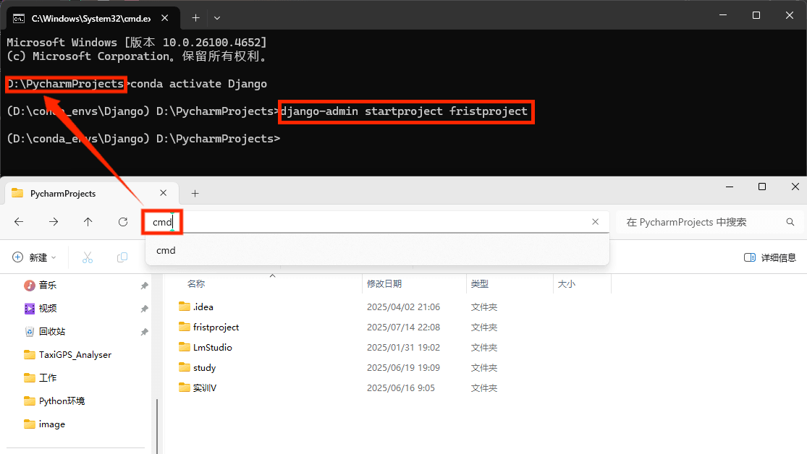
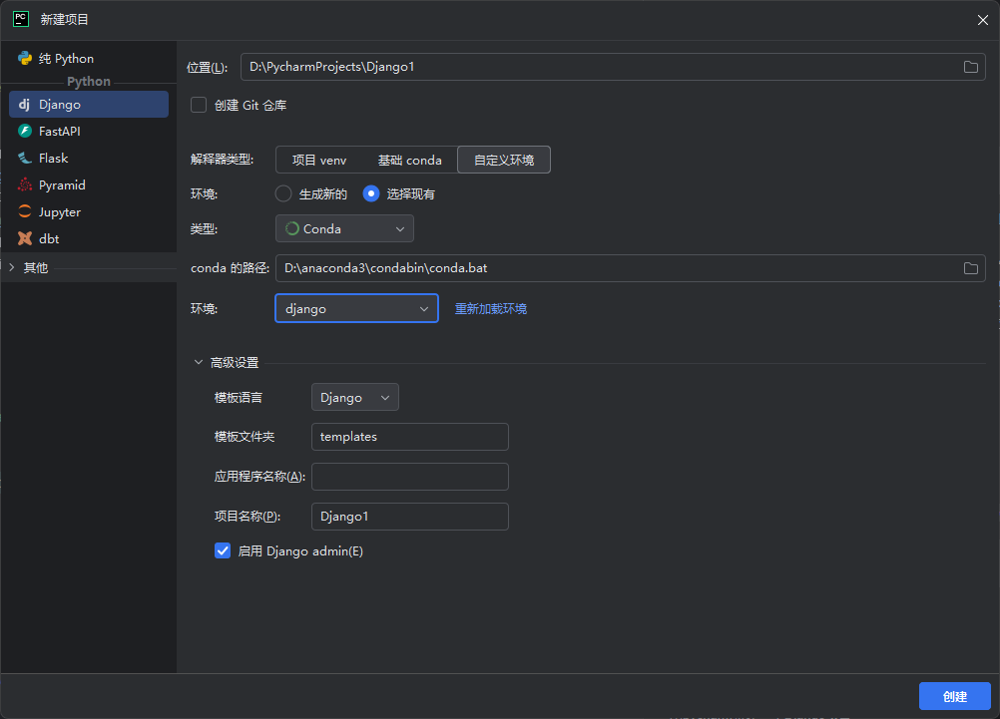

# 准备

Python > 3.10

django > 5.0

# 入门

## URL组成

URL是uniformResourceLocator的简写，统一资源定位符。

一个URL由以下几部分组成：

```
scheme://host:port/path/?query-string=xxx#anchor
```

- scheme：代表的是访问的协议，一般为http或者https以及ftp等。
- host：主机名，域名，比如`www.baidu.com`。
- port：端口号。HTTP协议是80端口，HTTPS协议是443端口。
- path：查找路径。比如:`www.jianshu.com/trending/now`，后面的trending/now就是path。
- query-string：查询字符串，比如:`www.baidu.com/s?wd=python`，后面的`wd=python`就是查询字符串。
- anchor：锚点，后台一般不用管，前端用来做页面定位的。
  注意：URL中的所有字符都是ASCII字符集，如果出现非ASCII字符，比如中文，浏览器会进行编码再进行传输。

## 创建一个Django项目

### 命令行方式

1. 创建项目：在终端中使用命令`django-admin startproject [项目名称]`，例如：

   ```bash
   django-admin startproject fristproject
   ```

   

2. 创建应用（app）：在终端中进入项目所在路径，执行如下命令均可创建一个app

   ```
   python manage.py startapp [app名称]
   ```

   ```
   django-admin startapp app_name
   ```

### pycharm方式

用pycharm新建一个Django项目



## 运行Django项目

### 命令行方式

```bash
python manage.py runserver
```

运行之后在`http://127.0.0.1:8000/`可以访问网站，若需要修改端口号可以在运行的时候指定端口号：`python manage.py runserver 9000`。另外这样运行的项目只能在本机上访问，如果想要在其他电脑上访问本网站，那么需要指定ip地址为0.0.0.0，示例：`python manage.py runserver 0.0.0.0:8000`。

### pycharm方式

运行Django服务器即可

- manage.py：以后和项目交互基本上都是基于这个文件。一般都是在终端输入`python manage.py [子命令]`，可以输入`python manage.py help`看下能做什么事情。除非你知道你自己在做什么，一般情况下不应该编辑这个文件。
- settings.py：本项目的设置项，以后所有和项目相关的配置都是放在这个里面。
- urls.py：这个文件是用来配置URL路由的。比如访问http://127.0.0.1/news/是访问新闻列表页，这些东西就需要在这个文件中完成。
- wsgi.py：项目与wsGI协议兼容的web服务器入口，部署的时候需要用到的，一般情况下也是不需要修改的。

project和app的关系

一个app代表一个模块，所以URL请求的响应都是由app来处理。Django项目由许多app组成，一个app可以被用到其他项目，Django也能拥有不同的app。

## URL与视图的映射

```Python
#views.py
from django.shortcuts import HttpResponse

def index(request):
    return HttpResponse("hello!")

#urls.py
import views

urlpatterns = [
    path('',views.index)
]
```

### 在URL中携带参数

1. 通过查询字符串：http://127.0.0.1:8000/s?wd=python&a=1&b=2

   ```python
   # book/views.py
   from django.shortcuts import HttpResponse
   
   #http://127.0.0.1:8000/book?id=2
   def book_detail_query_string(request):
       # request.GET={"id":2}
       book_id = request.GET.get('id')
       return HttpResponse(f"图书id为：{book_id}")
   
   # urls.py
   from book import views
   
   urlpatterns = [
       path("admin/", admin.site.urls),
       path("book", views.book_detail_query_string)
   ]
   ```

   

2. 在path中携带：http://127.0.0.1:8000/book/2

   ```python
   # book/views.py
   from django.shortcuts import HttpResponse
   
   def book_detail_path(request,book_id):
       return HttpResponse(f"图书id为：{book_id}")
   
   # urls.py
   from book import views
   
   urlpatterns = [
       path("admin/", admin.site.urls),
       # http://127.0.0.1:8000/book/2
       path("book/<int:book_id>", views.book_detail_path)
   ]
   ```

### path函数

path函数的定义为:path(route,view,name=None,kwargs=None)。以下对这几个参数进行讲解。

1. route参数：url的匹配规则。这个参数中可以指定ur1中需要传递的参数，比如在访问文章详情页的时候，可以传递一个id。传递参数是通过尖括号来进行指定的。并且在传递参数的时候，可以指定这个参数的数据类型，比如文章的id都是int类型，那么可以这样写\<int:id\>，以后匹配的时候，就只会匹配到id为int类型的url，而不会匹配其他的url，并且在视图函数中获取这个参数的时候，就已经被转换成一个int类型了。其中还有几种常用的类型：
   - str：非空的字符串类型。默认的转换器。但是不能包含斜杠。
   - int：匹配任意的零或者正数的整形。到视图函数中就是一个int类型。
   - slug：由英文中的横杠-，或者下划线_连接英文字符或者数字而成的字符串。
   - uuid：匹配uuid字符串。
   - path：匹配非空的英文字符串，可以包含斜杠/。
2. view参数：可以为一个视图函数或者是类视图.as_view()或者是django.urls.include函数的返回值。
3. name参数：这个参数是给这个url取个名字的，这在项目比较大，url比较多的时候用处很大。

### URL中包含另外一个urls模块

```python
# urls.py
from django.contrib import admin
from django.urls import path, include

urlpatterns = [
    path("admin/", admin.site.urls),
    path("book", include("book.urls")),
]
```

```python
# book/urls.py
from django.urls import path

from . import views

# 指定应用名称(应用命名空间)
app_name = "book"

urlpatterns = [
    # http://127.0.0.1:8000/book?id=2&name=三国演义
    path("", views.book_detail_query_string, name="book_string"),
    # http://127.0.0.1:8000/book/2
    path("/<int:book_id>", views.book_detail_path, name="book_path"),
]
```

### URL反转

之前我们都是通过url来访问视图函数。有时候我们知道这个视图函数，但是想反转回他的url。这时候就可以通过reverse来实现。示例代码如下：

```python
from django.urls import reverse

reverse("list")
> /book/list/
```

如果有应用命名空间或者有实例命名空间，那么应该在反转的时候加上命名空间。示例代码如下：

```python
reverse('book:list')
> /book/list/
```

如果这个ur中需要传递参数，那么可以通过kwargs来传递参数。示例代码如下：

```python
reverse("book:detail",kwargs={"book_id":1})
> /book/detail/1
```

因为django中的reverse反转ur1的时候不区分GET请求和PosT请求，因此不能在反转的时候添加查询字符串的参数。如果想要添加查询字符串的参数，只能手动的添加。示例代码如下：

```python
login_url = reverse('login') + "?next=/"
```

# 模版

## 模版介绍

### 模板渲染

```python
from django.shortcuts import render

def index(request):
    return render(request, 'index.html')
```

### 模版查找路径配置

在项目的`settings.py`文件中。有一个`TEMPLATES`配置，这个配置包含了模板引擎的配置，模板查找路径的配置，模板上下文的配置等。模板路径可以在两个地方配置。

1. DIRS：这是一个列表，在这个列表中可以存放所有的模板路径，以后在视图中使用`render`或者`render_to_string`渲染模板的时候，会在这个列表的路径中查找模板。
2. APP_DIRS：默认为True，这个设置为True后，会在INSTALLED_APPS的安装了的APP下的`templates`文件夹中查找模板。
3. 查找顺序：比如代码`render('1ist.html')`。先会在DIRS这个列表中依次查找路径下有没有这个模板，如果有，就返回。如果DIRS列表中所有的路径都没有找到，那么会先检查当前这个视图所处的app是否已经安装，如果已经安装了，那么就先在当前这个app下的`templates`文件夹中查找模板，如果没有找到，那么会在其他已经安装了的app中查找。如果所有路径下都没有找到，那么会抛出一个`TemplateDoesNotExist`的异常。

## DTL模版语法

### 变量

模板中可以包含变量，Django在渲染模板的时候，可以传递变量对应的值过去进行替换。变量的命名规范和Python非常类似，只能是阿拉伯数字和英文字符以及下划线的组合，不能出现标点符号等特殊字符。变量需要通过视图函数渲染，视图函数在使用`render`或者`render_to_string`的时候可以传递一个`context`的参数，这个参数是一个字典类型。以后在模板中的变量就从这个字典中读取值的。示例代码如下：

```python
# profile.html模板代码
<p>{{ username }}</p>

# views.py代码
def profile(request):
	username = '用户名'
	return render(request,'profile.html',context={'username':username})
```

模板中的变量同样也支持点（.的形式。在出现了点的情况，比`person.username`，模板是按照
以下方式进行解析的：

1. 如果person是一个字典，那么就会查找这个字典的username这个key对应的值。
2. 如果person是一个对象，那么就会查找这个对象的username属性，或者是username这个方法。
3. 如果出现的是person.1，会判断persons是否是一个列表或者元组或者任意的可以通过下标访问的对象，如果是的话就取这个列表的第1个值。如果不是就获取到的是一个空的字符串。

### 常用标签

#### if标签

```html

	已成年

	未成年

```

#### for标签

遍历列表

```html

	<p>{{ person.name }}</p>

```

如果需要反向遍历，则需加上reversed

```

	<p>{{ person.name }}</p>

```

遍历字典

```html

    <p>{{ key }}:{{ value }}</p>

```

在for循环中，DTL提供了一些变量可供使用。这些变量如下：

- forloop.counter：当前循环的下标。以1作为起始值。
- forloop.countero：当前循环的下标。以o作为起始值。
- forloop.revcounter：当前循环的反向下标值。比如列表有5个元素，那么第一次遍历这个属性是等于5，第二次是4，以此类推。并且是以1作为最后一个元素的下标。
- forloop.revcountero：类似于forloop.revcounter。不同的是最后一个元素的下标是从0开始。
- forloop.first：是否是第一次遍历。
- forloop.last：是否是最后一次遍历。
- forloop.parentloop：如果有多个循环嵌套，那么这个属性代表的是上一级的for循环。

#### for...in...empty标签

和for标签一样，只是当遍历的对象没有元素时输出empty中的内容

```html

	<p>{{ person.name }}</p>

	没有任何人

```

#### with标签


#### url标签


